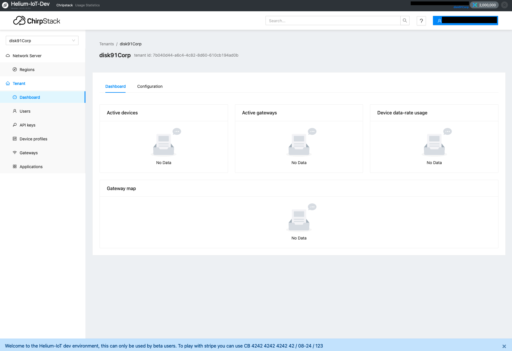

# Helium / Chirpstack integration



- Follow progress and roadmap on the [project board](https://github.com/users/disk91/projects/1/views/1)
- Test in on the live demo site [dev.helium-iot.eu](https://dev.helium-iot.eu)

### Features (development in progress)

- Manage fully configurable billing capabilities for helium
    - cost per uplink
    - cost per duplicates
    - cost per downlink
    - cost per device creation
    - cost per period of activity
    - cost per period of inactivity
    - cost pers DCs / minimum DCs volume purchasing
    - limit device DCs consumption on a given period of time
    - Limit device DCs consumption overall
    - upfront billing
    - end of month billing
- Allows public signup (or not)
- Ability to limit the number of device and tenant
- Manage the device declaration / deactivation on helium router
- Manage multi-tenant chirpstack environment
- Manage stripe payments to get DCs
- Manage DC transfer between payments
- Manage Service Request between customer and admin
- Manage Communication to users
- Manage Invoice generation
- Manage device migration from console
- Manage device live migration from console
- Manage device live Region change
- Manage Helium integration with forwarder


#### MVP1 - terminated
The MVP1 aim to support the backend device management to support the self hosting situation. It allows to detect device 
addition / removal to declare it on the Helium router automatically. This MVP also supports the DC consumption counting
and allows a large number of invoicing situations as defined above. All the billing configuration is driven by a 
configuration file for the default and can be overrided in the database at a tenant level. This MVP also build the usage 
statistics for later explaination of the invoicing.

#### MVP2 - terminated (tag V0.2)
The MVP2 aim to provide a muti-tenant, self boarding solution allowing seamless access to chirpstack and DC balance display.
It allows platform administrator to manage the tenant billing settings and router DC balance.

#### MVP3 - terminated (tag V0.3)
The MVP3 aim to provide the payment solution for increasing the tenant DC balance. It is planned to have a stripe support
for payment. Crypto payment will be developed once migrated to Solana, when the environment will be in place to test this.
It includes invoice generation for customers and Ticketing solution. It also allows to transfer DCs between tenants.

### MVP4 - terminated (tag V1.0.0)
The MVP4 aim to allow user to migrate devices from a legacy console to the new chirpstack / helium environment based on a wizard.
It allows to migrate one or many devices from one environment to another.

#### MVP5 - in progress
The MVP4 aime to provide the user screen to manage all the specific situation like device reactivation, access to invoice, 
consumption statistics... It also includes the users/customer communication solutions for the platform administrator.

#### MVP6 - pending
The MVP6 may address some specific program support like university program to offer a free access to Helium network for
universities. Support of coupons will allow larger program solution including devkit including communications ...


## Build the application

Installation is automated with a script and take under 5 minutes for a standard configuration.

As a pre-requisite:
- You need to have Ubuntu 22.x server ready (config 4VCPU / 8GB / 40GB or more)
- You need to have a domain name pointing to your server for https configuration or a public IP for http configuration.
- You need to have SMTP (service to send email) setup ready, if your don't master this, register on sendgrid, configure your email
and create an API key. 

Once you completed the pre-requisite, you can run setup script
```
bash ./makeiteasy.sh
```

For advanced user & usage, I recommend to follow the full installation guide including the Chirpstack configuration is detailed on (disk91.com blogpost)[https://www.disk91.com/2022/technology/helium/installing-chirpstack-lorawan-network-server-for-helium/]

### Debugging

In most of the cases, problems come from mis-settings during the configuration phase.
Some tips to help in debugging:

`docker ps` list the running services, if some are restarting on every 30 seconds, look at the service logs to identify the problem. `docker logs` *service_name* will show you the details.

`docker logs helium-helium-1 | grep -i error` also helps to identify the reason why the companion refuses to start or starts with some feature deactivated due to setting issues.

## Monitoring

The solution comes with `grafana` dashboard pre-configured and server / docker monitoring. `grafana` is not exposed publicly and
it can be accessed over a ssh tunnel or locally on port 8050. Default user / password is admin/admin.

## Stop the application
- clean exist with cache purge and queueing processes
 `curl -fX GET http://127.0.0.1:8090/internal/3.0/exit`
- send SIGTERM message to the process (sent when docker stop)


## License
This program is distributed according to [GPLv3](https://www.gnu.org/licenses/gpl-3.0.en.html) licence for any private 
IoT device fleet purpose, without restriction.

Specific licences can be obtained by contacting the Author. Any reuse of this code-source needs to be indicated and modifications/addition need to 
be publicly published, even when small pieces of code or architecture are reused as requested by GPLv3.

## Misc
- Nova service GRPC proto can be found on - https://github.com/helium/proto/blob/master/src/service/iot_config.proto
- Protoc - https://github.com/protocolbuffers/protobuf
- Stub pluggin - https://github.com/grpc/grpc-java/releases
- Download Stub pluggin - https://repo.maven.apache.org/maven2/io/grpc/protoc-gen-grpc-java/1.53.0/
- Command lines
```agsl
./protoc/bin/protoc --plugin=protoc-gen-grpc-java=.../protoc-gen-grpc-java-1.53.0-osx-x86_64.exe --java_out=... \
                    --grpc-java_out=...same... --proto_path=.../proto/src/ service/iot_config.proto
./protoc/bin/protoc --java_out=... --proto_path=.../proto/src/ region.proto
./protoc/bin/protoc --java_out=... --proto_path=.../proto/src/ blockchain_region_param_v1.proto
```

- Chirpstack-api grpc api found on - https://github.com/brocaar/chirpstack-api/tree/master
- gooogleapi found on - https://fuchsia.googlesource.com/third_party/googleapis
- Chirpstack grpc api found on - https://github.com/chirpstack/chirpstack.git
```bash
# for chirpstack grpc api
~ git checkout v4.3.2
```

````
./protoc/bin/protoc -I ./chirpstack/api/proto -I ./googleapis/ --java_out ./out ./chirpstack/api/proto/common/common.proto
./protoc/bin/protoc -I ./chirpstack/api/proto -I ./googleapis/ --java_out ./out ./chirpstack/api/proto/api/user.proto 
./protoc/bin/protoc -I ./chirpstack/api/proto -I ./googleapis/ --java_out ./out ./chirpstack/api/proto/api/device.proto
./protoc/bin/protoc -I ./chirpstack/api/proto -I ./googleapis/ --java_out ./out ./chirpstack/api/proto/api/request_log.proto
./protoc/bin/protoc -I ./chirpstack/api/proto --java_out ./out ./chirpstack/api/proto/api/frame_log.proto
./protoc/bin/protoc -I ./chirpstack/api/proto -I ./googleapis/ --java_out ./out ./chirpstack/api/proto/api/internal.proto

./protoc/bin/protoc -I ./chirpstack-api/protobuf --java_out ./out ./chirpstack-api//protobuf/as/as.proto
````
